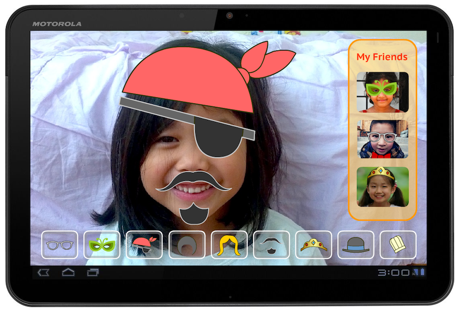
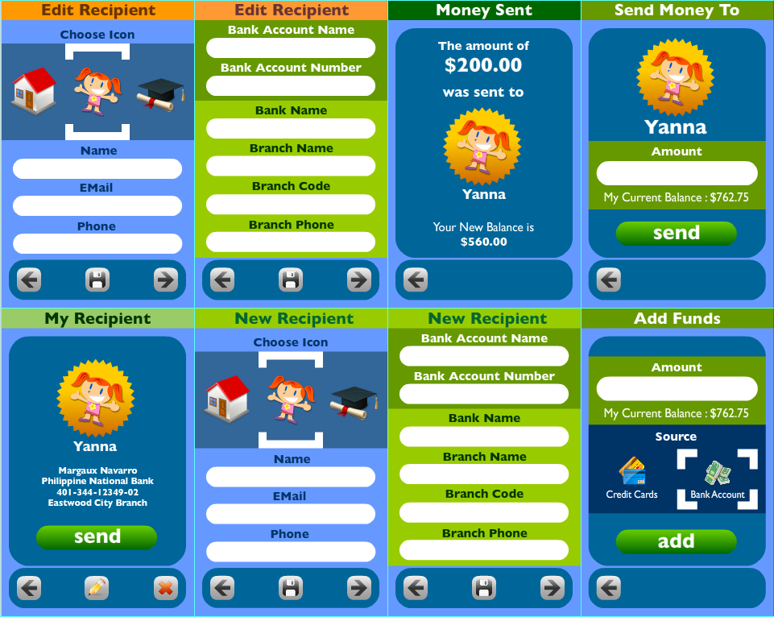

# Designs
For as long as I can remember, I have always found enjoyment and reward in creating, building and improving stuff.  By stuff, I mean pretty much anything that is used for any purpose: devices, tools, toys, software, processes, etc. I welcome any opportunity to examine existing products to find innovations and improvements, as much as inventing a new product.

This page presents a collection of ideas, designs and innovations I have come up with in the past 10 or so years.  They cover user interfaces, sporting equipment and assistive products.

## Children's Virtual Decoration App
As one of my main projects for a course in the Iowa State University's graduate program for Human Computer Interaction in 2012, I imagined and visualized a children's game application.  In this application children chat chat online with their friends and have fun by decorating their faces with virtual accessories like hats, sunglasses, facial hair (for make-believe characters) and other accessories.  Below is a high-fidelity mock of the application's main interface.

A couple of years after this I saw the same concept of virtual accessories implemented in the Facebook mobile app, as well as other mobile apps.

## Memory-Assistive Device and App
In the same course in the HCI program I attended in 2012 I came up with the idea of a set of tools that can help people with memory impairment.  The idea involved using an eyewear-mounted camera and a mobile application to enable the subject record their daily experiences.  The recorded videos and/or images can be annotated during recording, and later reviewed.

Below are the concept sketches of the physical object and wireframes for the partner application.

### Concept Sketch

### App Wireframes

## Novel Table Tennis Racquet Design
In 2013 I was playing table tennis frequently for a stretch of a few months.  During that time I started wondering if a more ergonomic and effective manner of holding and using the racquet is possible.  As a result I came up with the following racquet design.

### Concept Illustration

### Physical Implementation

## Mobile App for Managing/Sending Money
I come from a country where people often send goods and money to their family, relatives and other loved ones.  Being familiar about this in 2014 I visualized a mobile application for managing such activity.  Below are the collections of pages for the envisioned mobile app, ilustrated in high-fidelity. I later implemented a prototype of this applcation using the Adobe Flash/Flex platform.

## Path Guide UI Component
Working in GE Digital's Design division in 2016, I designed and implemented in Polymer a web UI component for indicating the status of a process divided in a sequence of steps.  Below is an illustration I made showing the essential visuals of the component, alongside its configuration options.

# Pigeon Trapdoor Design
One of my hobbies is raising and flying homing pigeons.  One of the essential parts of a homing pigeon loft (house) is a trapdoor where they can enter but not exit from.  After having seen a couple of trapdoor designs I came up with my own, as shown in the picture below.

The trapdoor is the wooden device shown placed on a metal table.  The hole facing front is where the pigeons go in.  This trapdoor is mounted higher than the floor of the pigeon loft so the birds can 'drop' going thru the hole.

